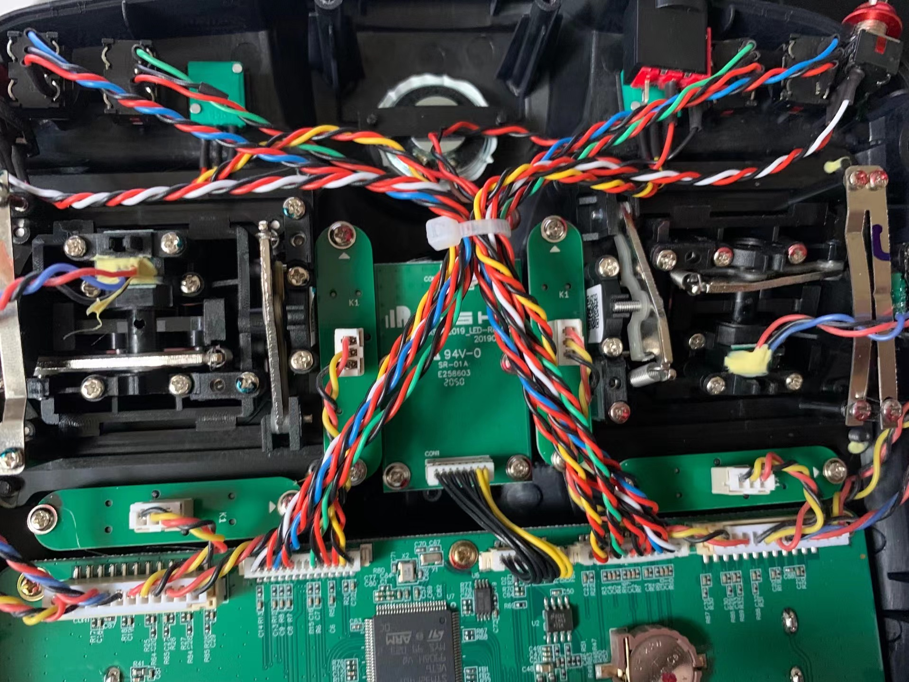

# [Frsky Taranis X9D Plus SE 2019](https://www.frsky-rc.com/product/taranis-x9d-plus-se-2019/)
板控
[手册](./assets/X9D%20Plus%202019%20X9D%20Plus%20SE%202019%20-Manual.pdf)

到手
* 电池盖在背后, 电池盖里面有SD卡插槽.
* 电池线(三针插头)连左边, **连右边会烧!!!**.
* 背后中间有老式USB插口充电和连电脑玩模拟器, 耳机孔.
* 背后上面是外置高频头安装插槽.双指捏盖揭开放高频头入槽.(可选)

设置操控
* 前面下半部分显示器用于设置, 左边三按钮Menu, Page, Exit, 右边一旋钮
* Menu短按选模型(Model, 即操控配置存档), 长按进工具菜单(刷固件, 查看版本等功能)
* Page短按跳下一个设置栏, 长按回上一个设置栏
* Exit退出设置(设置应该是自动保存的)
* 旋钮可以**转**和**按**, **按**确定,**转**可以设置字母

摇杆
* 除了油门,其他都能自动回中. 例如: 左手上下拨油门
* 摇杆附近有摇杆微调(横纵), 在CHANNELS MONITOR(Page切换)页面对摇杆校准

拨杆旋钮
* 在 Model(Menu短按)->MIXES(Page切换)栏可绑定拨杆和旋钮, 用于触发CH(通道, 对应无人机的AUX触发模式功能)

### 遥控器使用SD卡加载OpenTx系统

1. 下载对应的[SD卡系统包](https://downloads.open-tx.org/2.3/release/sdcard/).
2. 解压, 将压缩包根目录文件拷贝到SD卡根目录.
3. 拆开电池后盖拿出电池, 安装SD卡. 放入电池盖上后盖. 开机.
4. 能听到开机语音和报警提示语音.

### 改开机语音
1. 找个音乐 例如 song.mp3
2. 用此命令```ffmpeg -i song.mp3 -acodec pcm_s16le -ar 8000 -ac 1 song.wav```转换音乐为指定格式的wav.
   批量转换
   ```shell
   for item in `ls *.mp3`; do
    item=${item%.*}
    ffmpeg -i $item.mp3 -acodec pcm_s16le -ar 8000 -ac 1 $item.wav
   done
   ```
3. 先将原有的SOUND/SYSTEM/open.wav文件备份, 然后将song.wav放入SOUND/SYSTEM/open.wav路径. 开机后可听到开机声音.

### 固件相关
* [R9M2019高频头](./R9M2019_ELRS.md)
* [BetaFPV 2400 TX Micro 1W高频头](./BetaFPV_2400_TX_Micro_1W_ELRS.md)
* [刷OpenTX](./OpenTX.md)
* [刷EdgeTX](./EdgeTX.md)

### 拨杆调节

* 左拨杆(左手油门)(在图右边) 内部结构中, 图左边有个弹簧, 右边两个小拨片
* 左边弹簧连接的结构控制自动回中, 若安装螺丝卡住结构, 不会自动回中. 可以通过调整该螺丝安装位置, 改美国手和日本手.
* 右边两个小拨片, 左边拨片调整油门松紧度, 右边拨片调整齿轮段落感. 通过松紧螺丝调整.

### OpenTX系统下拨杆切换3D模式和普通模式
1. 首先穿越机必须设置为3D模式, 否则必然失控. 建议另外复制专门用于3D模式操控的Model来改写. **此方法会损失打杆精度, 若完全不用3D模式请选普通模式Model使用**.
2. 进入 Model->Mixed 设置油门杆位映射. 这里示例设置SB拨杆作为开关3D模式的拨杆.  
   自己油门杆位对应CH3(Ele), 复制该杆位对应状态并为两个对应状态分别编辑:  
   状态1: Weight 100 -> 50, Offset 0 -> 50, Switch --- -> !SB↓ (实际上是添加了拨杆映射值域 将拨杆位置的[-100,100]映射到通道的[0,100], 在3D模式下使用普通打杆操作)  
   状态2: Weight 100, Offset 0, Switch --- -> SB↓ (拨到底开启3D模式)  
###### 注意, 这里是模式错误下紧急处理方案:
  * 穿越机未设置3D模式, 遥控器使用了3D Model并误解锁:
    * 全程关闭3D模式拨杆开关的状态下, 无法正常的解锁和上锁.
    * 若已解锁, 打开3D模式拨杆开关,正常控制并上锁.
  * 穿越机设置了3D模式, 遥控器使用了非3D Model并误解锁:
    * 油门摇杆控制区域为[中点, 最高点], 迅速调整穿越机姿态并在中点上锁.

##### 其他
  * [语音包](./OpenTX_AUDIO.md)