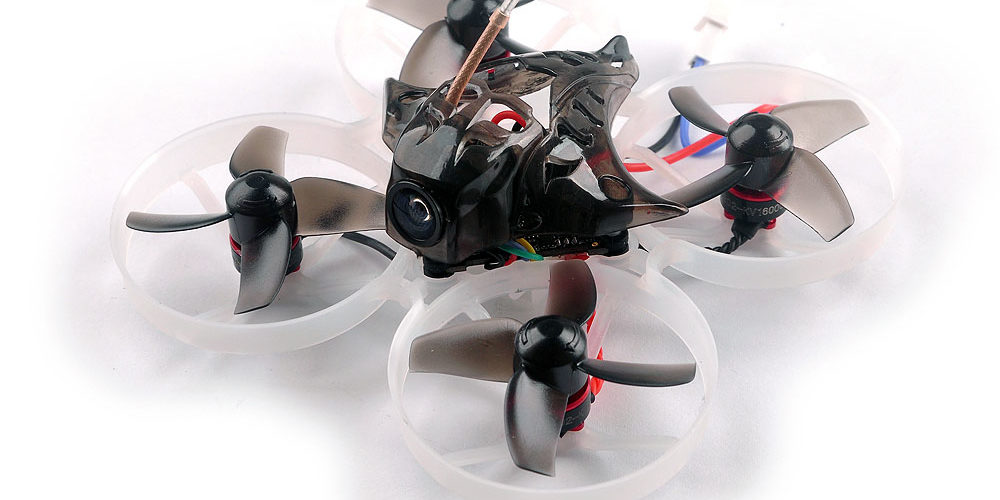

# [Mobula7 V2](https://www.happymodel.cn/index.php/2018/10/12/happymodel-75mm-2s-brushless-whoop/)

[文档](./assets/Mobula7-Frsky-Manual-F4-version.pdf)

小飞机, 可以串两块1s电池 或者 一块2s电池 或者一块1s电池.

### 飞前准备
内置接收机对频流程. 因为是FrskyD8/D16, 同[Tinyhawk2](./Tinyhawk2.md)
外置ELRS 2.4G对频. 使用ELRS2.4G高频头进行对频