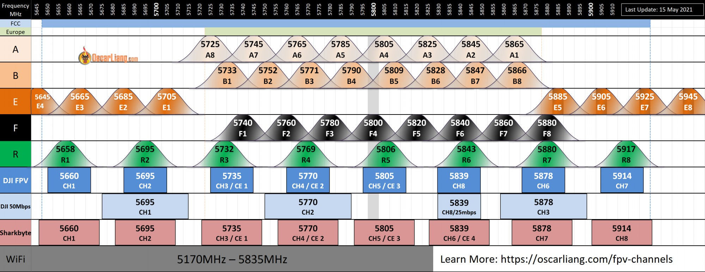

### [SKYZONE 04X](http://www.skyzonehobbies.com/sky04x.html)
图传眼镜

[手册](./assets/SKY04X%20USER%20MANUAL%20CN%20V1.4.pdf)

视频 [【兔蛋实验室】SKYZONE 04X 重磅问世 是否是你心目中的王者眼镜](https://www.bilibili.com/video/BV1MZ4y157bm)

* 先要贴魔术贴, 再粘皮套. 戴上眼镜. 电池可以用他送的那个电池挂眼镜上, 也可以用充电宝和线供电.
* 左右两旋钮, 左右两按钮. 操作很简单乱按就会用了. 右按钮是设置, 可以设置中文.
* 左按钮可以改输入模式, 可以改成HDMI连电脑当电脑屏幕.
* <del>输入选RF模式, 眼镜会自动扫频连飞机</del>. 右边滚轮长按进入扫频模式.

这个真没啥好讲的, 说明书都没看, 乱按都会用了.

#### 附录
* [频点图](https://oscarliang.com/fpv-channels/)

* 视频 : [模拟图传哪些频道不会被大疆干扰](https://www.bilibili.com/video/BV1p34y1Q7b3/)